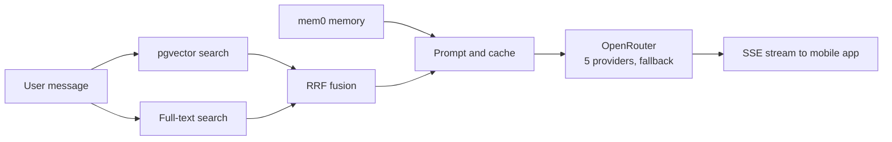

<h1 align="center">

</h1>

I'm an AI Engineer specializing in Agentic Workflows architecting autonomous systems that plan and self-correct. Currently, I am engineering a SaaS-grade geospatial lead generation engine alongside a GenAI marketing workflow using Gemini and Nano Banana Pro to automate high-fidelity Meta ad creation.

My focus is on Human-in-the-Loop pipelines that turn probabilistic models into deterministic business value. Leveraging Python, LangGraph, FastAPI, and Docker, I build robust architectures designed to solve production challenges like inference latency and RAG hallucinations.

---

## 🆕 Latest: Saroya AI

From February to September 2026 I was the only backend engineer on Saroya AI, a mobile app from TinyCheque (an AI-first venture studio) where creators build an AI avatar that their audience chats with. I wrote the API from scratch, built the ingestion pipeline, and ran the service from May 2026 until it reached testers on the Play Store and TestFlight. I write the eval set before I trust a change, so the numbers below come from a 71-question golden set that runs in CI.

| Metric | Before | After |
| :--- | :---: | :---: |
| Retrieval latency | 5 to 8 s | 0.6 s |
| Retrieval recall | 0.53 | 0.98 (MRR 0.89) |
| Cached-input ratio on LLM calls | n/a | 78% |

Graph-database queries were slow enough to time out streaming responses, so I moved retrieval to Postgres with pgvector and full-text search, fused with reciprocal rank fusion (RRF), and added mem0 for long-term memory.

Simplified view of the chat path.

---

## 🔍 Summary

- 🛠️ **AI Engineer** with production experience in building **Agentic RAG** systems, and **GenAI Marketing Pipelines**.
- 🧠 Hands-on experience training and refining **LLMs**, developing **CNN architectures**, and model deployment.
- 🔧 Proven track record of delivering business impact, including reducing content production costs by **100%** via automated **GenAI workflows** (Gemini/Nano Banana)
- 🚀 Sole backend engineer on a production GenAI mobile app: retrieval recall up from 0.53 to 0.98 and latency down from 5 to 8 s to 0.6 s, verified by an eval harness and gated on SLOs in CI.
- 💸 Built the LLM cost controls for that app, including prompt and reply caching and provider fallback, which reached a 78% cached-input ratio.

---

## 💼 Experience

### **AI Engineer | TinyCheque (Saroya AI)**
_Feb 2026 to Sep 2026_
* **Retrieval:** Cut retrieval latency from 5 to 8 s to 0.6 s and lifted recall from 0.53 to 0.98 (MRR 0.89). I moved retrieval to Postgres pgvector with full-text search, RRF fusion and mem0 memory, then wrote a 71-question golden set and eval harness to check that quality held.
* **Backend:** Built and ran the whole backend alone. I wrote the TypeScript/Node/Express API from scratch (auth, Razorpay payments, creator onboarding, chat) and operated it from May 2026 through the release to testers on Play Store and TestFlight.
* **LLM cost:** Real routing costs overran my cost model, so I instrumented every call, added prompt and reply caching, and pinned OpenRouter to 5 providers with fallback. The cached-input ratio reached 78%, and a weekly CI check alerts below 70%. Tokens stream to mobile over SSE with pacing and keepalive.
* **Ingestion:** Built the pipeline behind every avatar. It pulls creator content from X, Reddit, YouTube and LinkedIn, plus PDF, DOCX, XLSX and PPTX uploads with OCR. I added KYC identity checks and hard-delete workflows across every data store.
* **Pricing:** Originated the creator pricing and credit model the CPO adopted, plus the PRDs, ADRs and cost analyses the team planned against.
* **Tooling:** Set up a Claude Code harness with 14 subagents, 22 slash commands, and MCP tools and hooks that enforce spec-first and test-first work, backed by a 169-test suite.

### **AI Automation Engineer (Contract) | Chitra Goenka Crafts & Creations**
_Remote | Jan 2025 – Feb 2026_
* **GenAI Pipeline:** Architected a marketing workflow using **Nano Banana Pro (Gemini)** and **LangChain** to generate photorealistic product assets, cutting photoshoot costs by **100%**.
* **SaaS-Grade Tooling:** Engineered a **Geospatial Lead Finder** using Google Maps API that extracts global B2B leads with sub-second latency.
* **Deployment:** Built a **Streamlit** dashboard allowing non-technical staff to trigger complex scraping and generation tasks.

### **Software Engineer (Training Data) | G2i**
_Remote | Mar 2025 – Aug 2025_
* **RLHF & Data Quality:** Optimized AI-generated code by correcting logic errors to create high-quality ground truth data for training foundation models.
* **Safety & Compliance:** Enforced strict safety guidelines on code outputs to ensure compliance for production deployment.

### **Computer Vision Intern | CodeSpaze**
_Remote | Nov 2024 – Dec 2024_
* **Custom CNNs:** Architected a multi-class object recognition model (vehicles, biological entities), achieving **90% accuracy** via ensemble techniques.
* **Real-Time Inference:** Deployed a live inference pipeline via Streamlit for instant visual validation.

---

## 🌟 What makes me "Unusual"?

I don't just train models, I break them to see how they fail.
* **Agent First:** I believe the future isn't bigger models, but smarter **agentic loops**. I code for the future where AI plans, not just chats.
* **Rapid Learner:** Learned Swarm Robotics from scratch in 3 weeks for my dissertation because standard robotics felt too "safe."

## 🚀 About Me

* **Current Focus:** Architecting "Human-in-the-Loop" systems for B2B automation.
* **My Philosophy:** An AI model is only as good as the **pipeline** around it. I spend 20% of my time on the model and 80% on the **orchestration** (LangGraph), **data engineering** (RLHF), and **deployment** (FastAPI/Docker).
* **What I'm Building:** A geospatial lead-generation engine that combines Google Maps API with autonomous scraping agents to find B2B leads globally.
* **Language Mix:** Python first, plus TypeScript for the production backend I shipped this year.

---

## 🧪 Selected Projects

My recent production work is in private repos, so these are the public ones.

| Project | What it does | Stack |
| :--- | :--- | :--- |
| [meta-ad-creator](https://github.com/unusual9guy/meta-ad-creator) | Five cooperating Gemini agents turn a product photo into a 1080 x 1080 Meta ad image. | Gemini, Streamlit, Docker |
| [market-research-agent](https://github.com/unusual9guy/market-research-agent) | Three agents take a company or industry name and produce a market research report with AI use cases and matching datasets. | LangChain, OpenAI, Tavily, Exa |
| [pizzeria-review-agent](https://github.com/unusual9guy/pizzeria-review-agent) | Local RAG over restaurant reviews, so inference needs no cloud calls and costs nothing per query. | ChromaDB, Ollama, Llama 3.2 |
| [AI-Agent-for-research](https://github.com/unusual9guy/AI-Agent-for-research) | Research assistant that writes a structured report on any topic, with a hosted demo. | LangChain, Streamlit |
| [Swarm-Robot-Simulation](https://github.com/unusual9guy/Swarm-Robot-Simulation) | BSc dissertation: simulating and optimizing the beta algorithm for swarm connectivity with e-puck robots. | Webots, C |
| [Image-Classification-CNN](https://github.com/unusual9guy/Image-Classification-CNN) | Three CNNs on CIFAR-10 (best single model 89% test accuracy) and an ensemble comparison. | TensorFlow, Keras |

---

## 🎓 Education

BSc (Hons) Artificial Intelligence, 2:1, University of Manchester (2021 to 2024). Dissertation: simulation and optimization of the beta algorithm for autonomous swarm robotics.

---

## 🛠️ Skills

- **Agent Harness:**

<a href="https://opencode.ai/" target="_blank"><picture><source media="(prefers-color-scheme: dark)" srcset="https://cdn.simpleicons.org/opencode/ffffff"></picture></a>

- **Languages:**

<!-- 
 -->

- **AI/ML:**

- **Tools:**

- **APIs:**

- **Backend & DevOps**

- **Also in use:** Express, pgvector, FalkorDB, ChromaDB, OpenRouter, mem0, Cloudflare R2, Apify, Railway, OpenTelemetry, SigNoz, Claude Code (custom subagents, skills, hooks), MCP

---

## 📊 GitHub Stats

---

## 🤝 Let's Connect

I am actively looking for **AI Engineering** roles where I can deploy agentic systems to production. I'm based in Kolkata and available immediately, and I'm open to applied AI, forward-deployed and AI solutions engineering roles in India, Germany and the UK.

<!-- -->

<h1 align="center">

</h1>

